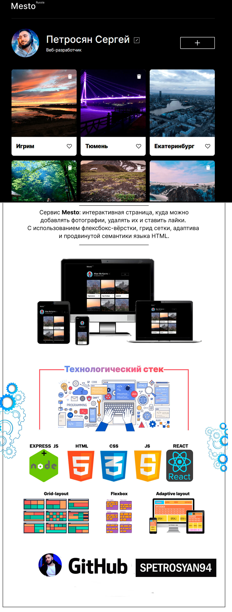

# Проект: "Mesto"

## Описание

Сайт "Mesto" представляет собой интерактивную страницу, где пользователи могут делиться фотографиями различных мест, добавлять описания и ставить лайки, а также менять информацию в профиле о себе и регистрироваться новым пользователям.

## Скриншот

## Функциональность

На сайте реализованы следующие функции:

1. Редактирование профиля пользователя (имя, информация о себе, аватар)
2. Добавление новых фотографий с указанием названия и ссылки на изображение.
3. Просмотр фотографий других пользователей
4. Постановка и снятие лайков на фотографии, счетчик лайков.
5. Удаление своих добавленных карточек с фотографиями.
6. Возможность открытия изображений в полноэкранном режиме.
7. У лайков реализована анимация при нажатии.
8. При ошибке соединения с сервером появится Popup окно с кодом и текстом ошибки.
9. Добавлена возможность регистрации и аутентификации пользователя
10. Произведена интеграция с ещё одним REST API для регистрации и аутентификации пользователей.

## Технологии

Сайт "Mesto" разработан с использованием следующих технологий:

- HTML
- CSS
- JS
- React
- Бэкенд сервера на Node.js express
- БД MongoDB
- Авторизация и регистрация пользователей
- API
- Webpack
- БЭМ, включая использование схемы файловой структуры Nested
- Адаптивная вёрстка
- Семантическая вёрстка

## Дополнительная информация

- Фронтенд часть проекта реализована на React.

- Бэкенд часть проекта реализована на Node.js библиотеке express.

- База данных на сервере MongoDB.

- Сайт "Mesto" является учебным проектом, разработанным в рамках обучения на курсе "Веб-разработчик" от [Яндекс Практикум](https://practicum.yandex.ru/).

- Ссылка проекта на GitHub Pages: [https://github.com/spetrosyan94/react-mesto-auth](https://github.com/spetrosyan94/react-mesto-auth)

- [Ссылка на макет в Figma](https://www.figma.com/file/2cn9N9jSkmxD84oJik7xL7/JavaScript.-Sprint-4?type=design&node-id=0-1&mode=design&t=GLKrvOxwA5loCYtx-0)

## Дополнительная информация

- В проекте использованы API для работы с фотографиями и пользователями. Для полноценной работы сайта, необходимо наличие доступа к интернету.

- Сайт "Mesto" является учебным проектом, разработанным в рамках обучения на курсе "Веб-разработчик" от Яндекс Практикум.

## Возможные улучшения

В дальнейшем можно реализовать следующие функции:

- Добавление комментариев к фотографиям
- Поиск фотографий по ключевым словам
- Сортировка фотографий по популярности или дате добавления
- Создание галерей с различными тематиками фотографий

## Автор

**Петросян Сергей**

Сайт "Mesto" разработан и поддерживается [Петросяном Сергеем](https://github.com/spetrosyan94) - https://github.com/spetrosyan94.

e-mail: [syspect@bk.ru](mailto:syspect@bk.ru)

telegram: [@solidhard1](https://t.me/SolidHard1) - https://t.me/SolidHard1
